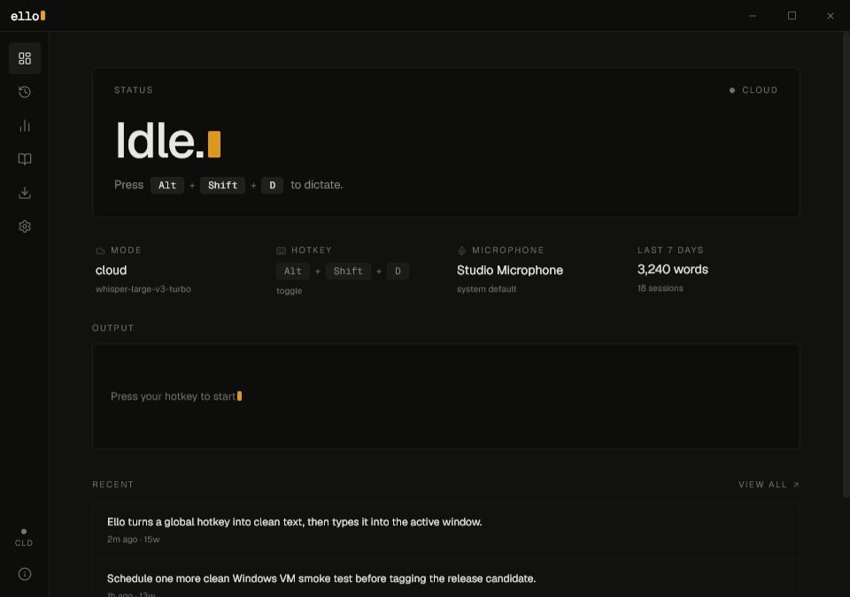

<div align="center">
  

# Ello

[](https://github.com/FadhilahAfif/Ello/actions/workflows/ci.yml)
[](https://github.com/FadhilahAfif/Ello/releases/latest)
[](LICENSE)

</div>

A Windows-first dictation app that records from a global hotkey, transcribes
locally with Whisper or remotely with Groq, then types the result into the
active window.



## Features

- **Global hotkey dictation** — toggle or push-to-talk, anywhere in Windows.
- **Two transcription modes** — local Whisper (offline, private) or Groq cloud
  (`whisper-large-v3-turbo` by default).
- **Active-window typing** with automatic clipboard fallback when typing fails.
- **Custom vocabulary** — exact, prefix, and contains rules with case-sensitive
  matching, applied to every transcript.
- **Optional AI polish** — pipe transcripts through a Groq chat model to remove
  fillers, fix grammar, or reformat.
- **Transcript history** with FTS5 full-text search, copy, and bulk export to
  txt / json / markdown.
- **Usage stats** — words, sessions, average WPM, estimated time saved.
- **Local model manager** — download GGML models with checksum validation.
- **Live mic meter**, dark theme, system tray, opt-in autostart, signed
  auto-updates.

## Quickstart

Ello has not had a public release yet. Until the first release is tagged, use
the source build below.

After `v1.0.0` is published:

1. Download the latest installer from the [Releases](https://github.com/FadhilahAfif/Ello/releases/latest) page.
2. Run the installer and launch Ello. The first-run wizard will guide you through
   picking Cloud or Local mode, setting your API key or downloading a model,
   choosing a hotkey, and testing your microphone.
3. Press your hotkey anywhere in Windows to start dictating. Ello transcribes
   your speech and types the result into whichever app has focus.

## Privacy

- **Local mode** keeps audio and transcripts entirely on your machine.
- **Cloud mode** uploads audio to Groq for transcription. The first time you
  enable Cloud mode, Ello shows an explicit upload warning. Your API key is
  stored locally via `tauri-plugin-store` and is never sent anywhere except
  Groq.
- Transcript history and usage stats live in a local SQLite database
  (`ello.db`) in your app data directory.
- See [PRIVACY.md](PRIVACY.md) for the full breakdown of what is stored, what
  is sent over the network, and how to wipe everything.

## Building from source

Ello is a [Tauri 2](https://tauri.app/) app: React + TypeScript on the front
end, Rust on the back end.

### Prerequisites

- Rust stable
- Node 20+
- MSVC Build Tools (Visual Studio 2022 or Build Tools for Visual Studio 2022)
- CMake 3.20+
- LLVM / libclang (required by `whisper-rs`'s bindgen step)

See [CONTRIBUTING.md](CONTRIBUTING.md) for the full toolchain setup.

### Build and run

```sh
npm install
npm run tauri dev          # development
npm run tauri build        # release installer (MSI + NSIS)
```

### Tests

```sh
cargo fmt --check
cargo clippy -- -D warnings
cargo test
npm run build
```

Cloud and local-Whisper integration tests are gated on `GROQ_API_KEY` and
`WHISPER_MODEL_PATH` respectively, and are skipped when those env vars are
unset.

## Contributing

Bug reports, feature requests, and pull requests are welcome. Read
[CONTRIBUTING.md](CONTRIBUTING.md) for the toolchain, testing rules, commit
conventions, and updater-key handling. Please follow the
[Code of Conduct](CODE_OF_CONDUCT.md).

To report a security issue, see [SECURITY.md](SECURITY.md).

## Project status

Ello has not yet had a public release. The `main` branch is the v1 release
candidate; tracked work and verification before tagging `v1.0.0` lives in
[`CHANGELOG.md`](CHANGELOG.md) under the `[Unreleased]` section. Windows is
the only supported platform for v1; macOS and Linux are post-v1.

## License

[MIT](LICENSE) © 2026 Muhammad Afif Fadhilah.
